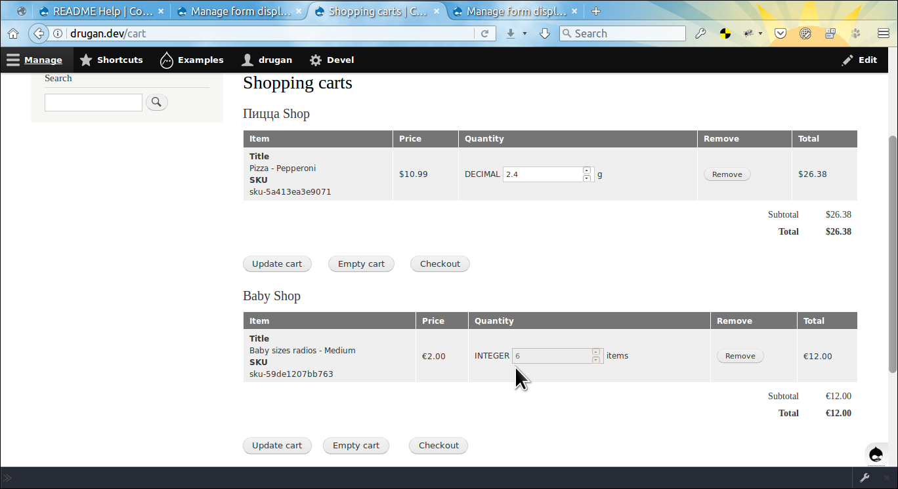
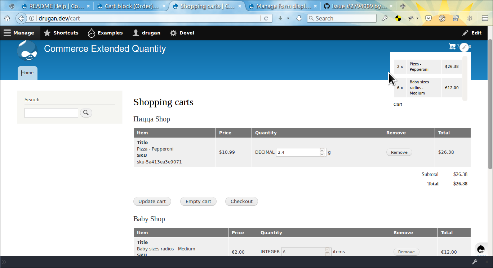
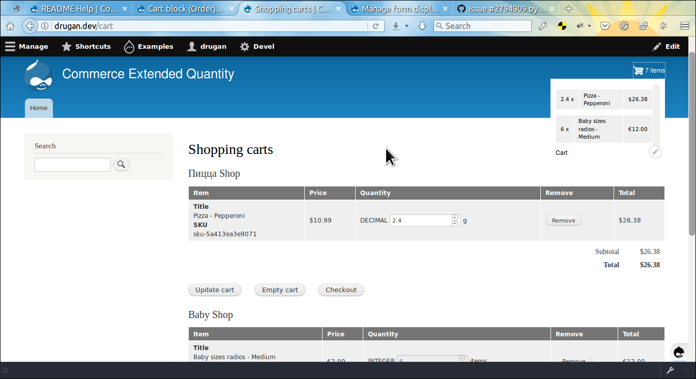

Commerce Extended Quantity
==========================

Allows to set quantity field's **default_value**, **step**, **min**, **max**,
**prefix** and **suffix** on a form display widget. Additionally, validates user
input on the field and order item availability both on the *Add to cart* form
and *Quantity* column of the *Shopping cart* table. More info could be found on
the [Extended Number Field ↗](https://github.com/drugan/xnumber) module's page, on
top of which the current module is built.

- [admin/help/commerce_xquantity#set-up](#set-up "Set up")
- [admin/help/commerce_xquantity#important-notes](#important-notes "Important notes")
- [admin/help/commerce_xquantity#module-author](#module-author "Module author")
- [Commerce Extended Quantity on drupal.org ↗](https://www.drupal.org/project/commerce_xquantity)
- [Commerce Extended Quantity on github.com ↗](https://github.com/drugan/commerce_xquantity)

## Set up

If you want to expose *quantity* field for a customer on the *Add to cart* form,
then go to
the [admin/commerce/config/order-item-types/default/edit/form-display/add_to_cart](#0 "Default order item") page
and enable *Quantity* field on the respective form display mode. The default
order item type is taken as an example. Actually, might be any order item.


The quantity widget settings' summary contains following items:

- **default value:** The default value to pre-fill on the *Add to cart* form for
a customer.
- **step:** The main setting on the widget. Defines the allowed amount to
increment or decrement the field value. So, the value entered must be an exact
multiple of the amount. Actually, this setting also defines a sub-type of the
field. For example, If you set it to an integer value then the field  becomes
integer despite being initially decimal field with precision *14,4*. No decimal
values will be accepted for the field. The same with decimal *step* value. If
you set it, for example to *0.5* value then no decimal values like *0.05* or
*0.005* or *0.0005* will be accepted despite the initially allowed decimal part
of the field up to 4 digits. However, the *1* or *2* or *99* will be accepted
because these numbers are multiples of the *0.5* step. For the most common set
up you might set it to *1*. If you sell, for example t-shirts but want your
customers add to cart only even quantities, then you might set it to *2* and
force them to buy *2* or *4* or *98* but not *1* or *3* or *99* t-shirts.
- **min:** The minimal value allowed. Use it to force customers to buy no less
than the value. Should be the multiple of the *step* property and no greater
than the *max* property.
- **max:** The maximum value allowed. Should be the multiple of
the *step* property and no less than the *min* property. Use it to restrict
customers for the order item quantity to buy.
- **prefix:** The text appearing before the quantity field.
- **suffix:** The text appearing after the quantity field.
- **placeholder:** The text appearing inside the empty quantity field.
- **base_default_value:** The value defined for the field in code
(currently *1*).
- **base_step:** The calculated value which is the minimal step for the
decimal field with the precision *14,4* (*0.0001*).
- **floor:** The most minimal positive value for the field. Note that this value
is overriden by the *step* property, which must be greater than *0* by its
nature.
- **ceil:** The most maximum value for the decimal field with the
precision *14,4*.

If you don't want to expose *quantity* field for a customer on
the *Add to cart* form, then do the same settings on the *Default* form mode
form display widget. Note that in this case the field in the *Quantity* column
of the *Shopping cart* table wiil be disabled as the logic implies that you
disallow customers to change (update) this order item's quantity. Look at
the *INTEGER* quantity field below:



## Important notes

As the quantity field is not required a customer may empty the field and try to
submit the form. On the *Add to cart* form an error will be emitted with the
minimal value allowed to submit to a customer. On the *Shopping cart* table it
just removes the order item from the cart. The same approach is taken with an
attempt to submit a *0* quantity.

The *Commerce Extended Quantity* module introduces a new notion of the order
item quantity:

**QUANTITY = NUMBER_OF_ITEMS ^ NUMBER_OF_UNITS**

Where **ITEM** is any separate item that must be measured in integer value
== *1*. Where **UNIT** is any non-zero unit of the **ITEM** that must be
measured in decimal up to *4* digits after decimal sign and where one and only
one **ITEM** is a set of multiple **UNITS**.

Another words, if you have *1.999 g* of pizza in your *Shopping cart* then it is
considered as *1* item with the quantity of *1.999*. If you have *2.000 g* of
the pizza then it is the same: *1* item with the quantity of *2.000*. But if
the *step* on the quantity field is integer and the quantity in
the *Shopping cart* is *2*, then it is considered as two separate items with the
quantity of *2*.

The *Drupal Commerce* experts should not be scared by the approach above because
the only place where it is implemented is the *Shopping cart block*, where
quantities displayed differently for the fields having integer or
decimal *step*.

@PHPFILE: modules/contrib/commerce_xquantity/src/Plugin/Block/XquantityCartBlock.php LINE:46 PADD:5 :PHPFILE@

All the other code such as price or tax calculation has no any impact with the
notion and as usual uses this method:

```
$quantity = $order_item->getQuantity();
```

The current *Drupal Commerce* module forcibly casts decimal quantity in
the *Shopping cart block* to integer value which is confusing and might mislead
a customer:

```
$count += (int) $order_item->getQuantity();
```

However, with the *Commerce Extended Quantity* module you may encounter the
following quantities in the *Shopping cart block*:



Again, the decimal quantity is truncated in the block. To mitigate the issue go
to the [admin/structure/views/view/commerce_cart_block](#0
"Cart block view") page, open *order item: Quantity* for editing and do the
following changes:


And you'd get this:



## Have a good sales' quantity!

###### Module author:
```
  Vladimir Proshin (drugan)
  [proshins@gmail.com](proshins@gmail.com)
  [https://drupal.org/u/drugan](https://drupal.org/u/drugan)
```
