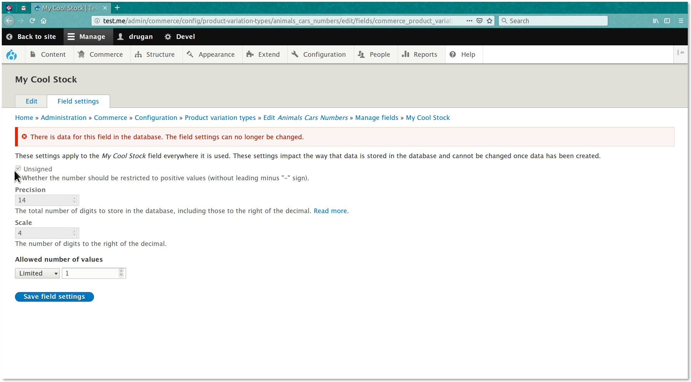
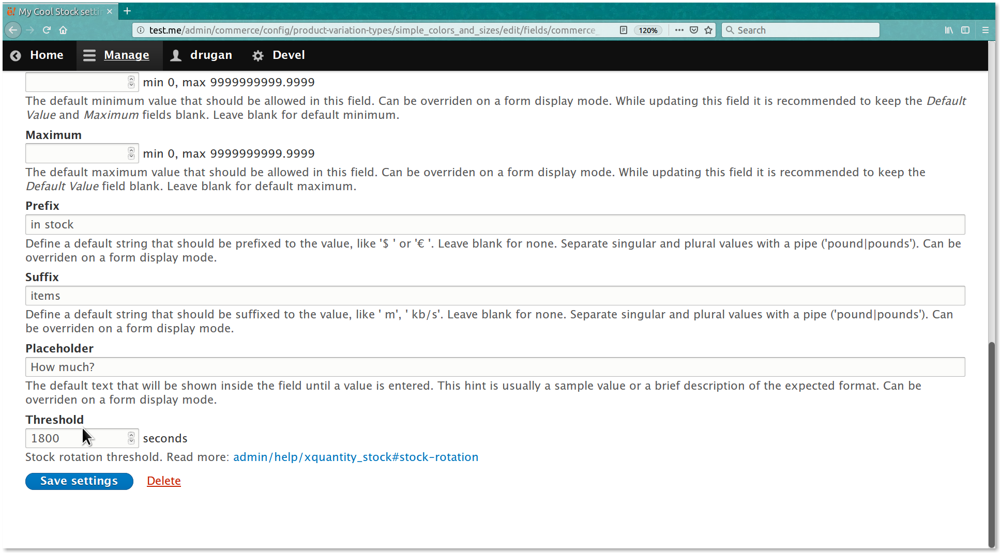
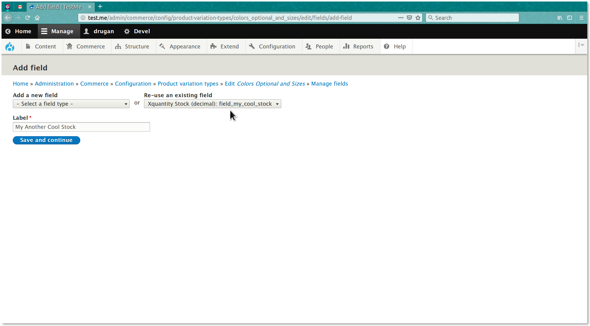
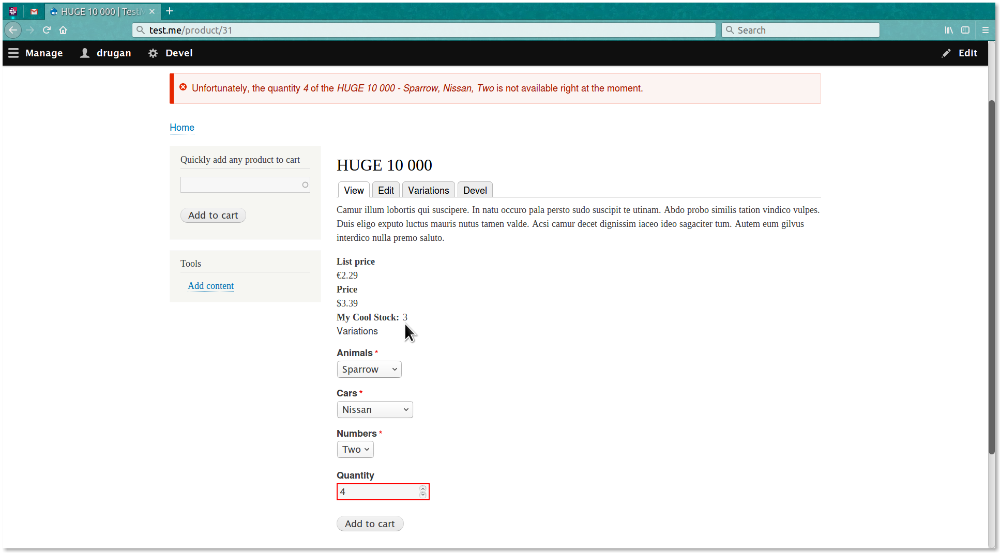

Commerce Extended Quantity Stock
==========================

Handles a commerce product variation stock.

> Tip: you can see this file in your browser by clicking
the [admin/help#](#0 "? Help") link at the right of the *Admin toolbar* and then
the [admin/help/xquantity_stock#](#0 "Commerce Extended Quantity Stock") link in
the list.

## The Base Module

- [Commerce Extended Quantity on drupal.org ↗](https://www.drupal.org/project/commerce_xquantity)
- [Commerce Extended Quantity on github.com ↗](https://github.com/drugan/commerce_xquantity)

## Setup

This functionality can be enabled by adding the **Xquantity Stock** field type
to a desirable product variation type. If you have no plan to create your own
negative stock handler then check the _unsigned_ checkbox for this field
database storage settings:



It is recommended to use for this field widget the same settings as
the _quantity_ field settings on the _Add to cart_ mode widget of the related
order item type. Just because the stock should be increased / decreased with the
same `step` as the variation _quantity_ in a customer _Shopping cart_.

## Stock rotation

Optionally, you can set the number of seconds to consider a Shopping cart
an abandoned one. Leave this field empty to not rotate the stock.

Let's say a customer _A_ added some quantity to a cart and does not done any
changes in their cart for some amount of time. Then a
customer _B_ attempts _Add to cart_ a quantity which is not available on a
variation stock but exist on an order item in the customer _A_ cart and may be
other carts. In this case order item(s) in the abandoned cart(s) will be
automatically removed to return this quantity to the stock and make it available
for customers to buy.

Then, if the customer _A_ returns to the site and sees that earlier added order
item has disappeared and attempts add this variation which is now in the
abandoned cart of the customer _B_ then this order item will be removed
releasing this quantity for the customer _A_ . This rotation will continue until
some of them will complete the order.



If multiple variation types use the same common order
item type then after the first **Xquantity Stock** field is added to a variation
type all the rest might be added with this existing field instead of creating a
new one:



Then add the stock value for each product variation of this type. If you enable
the [Commerce Bulk ↗](https://www.drupal.org/project/commerce_bulk) module then
product variations' stock quantities might be set or adjusted in bulk with
the _Set stock_ and _Adjust  stock_ configurable actions. Optionally you can add
this field to the _Variations Tab_ view to display the stock quantities:


The decrease / increase of a variation stock is done automatically whenever the
variation quantity is updated in a _Shopping cart_ or related order item or
entire order is deleted or canceled. So, applying your own
outdated _Shopping cart_ deletion strategy you'll return variations quantities
to their stock back again. Note that module uses the strict stock model and if
some variation has no positive stock value or the value is insufficient then it
is considered as _unavailable_ for adding to _Shopping cart_ by a customer:



If you have some specific requirements to which variations stock functionality
should be applied then you can implement
the **HOOK_xquantity_availability_applies_alter()**. See the example in
the *xquantity_stock.module* file:

********************************************************************************

@PHPFILE: xquantity_stock.module LINE:15 PADD:6 :PHPFILE@

********************************************************************************

Also, variation availability and its stock can be adjusted dynamically by
implementing the **HOOK_xquantity_availability_check_alter()**. That way you can
apply your own _Always in stock_ strategy for some variations. See the example
in the *xquantity_stock.module* file:

********************************************************************************

@PHPFILE: xquantity_stock.module LINE:29 PADD:6 :PHPFILE@

********************************************************************************

And finally, if you want to alter the error message shown to a customer when
unavailable quantity attempted to add to a _Shopping cart_ then implement
the **HOOK_xquantity_add_to_cart_not_available_msg_alter()**. See the example in
the *xquantity_stock.module* file:

********************************************************************************

@PHPFILE: xquantity_stock.module LINE:45 PADD:6 :PHPFILE@

********************************************************************************

## Have a good stock sales!

###### Module author:
```
  Vlad Proshin (drugan)
  [proshins@gmail.com](proshins@gmail.com)
  [https://drupal.org/u/drugan](https://drupal.org/u/drugan)
```
